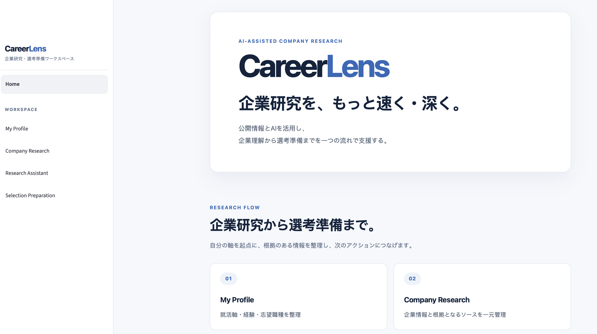
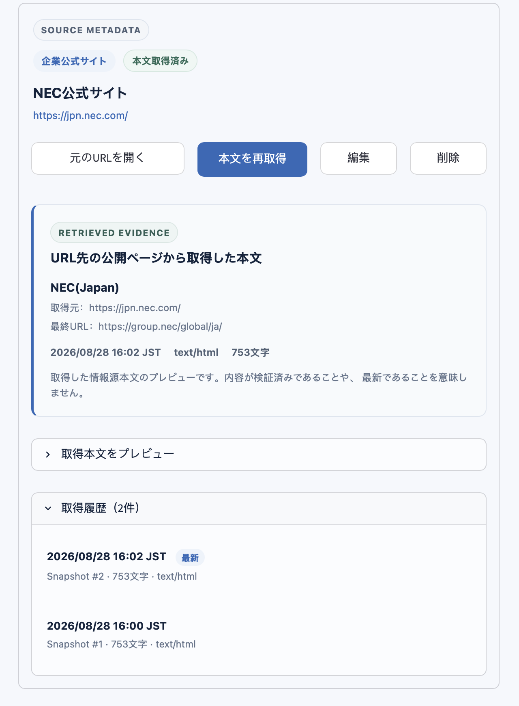
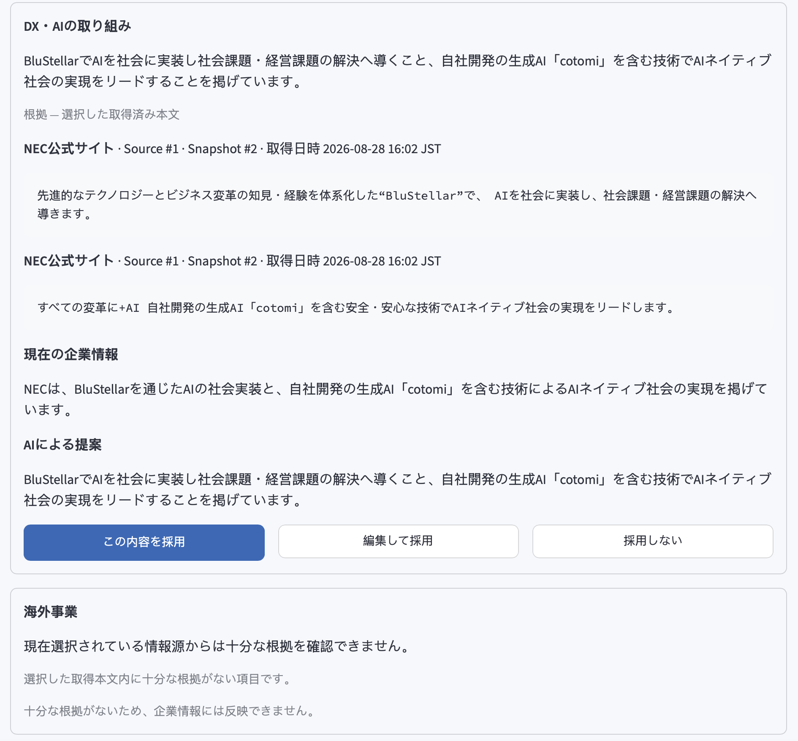
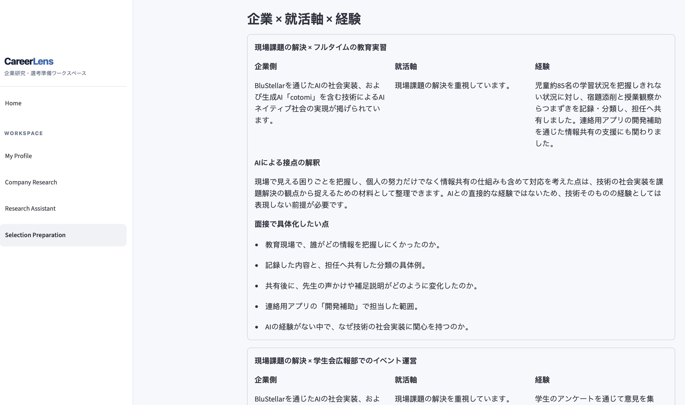
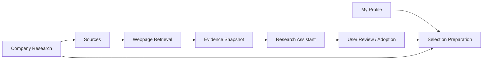
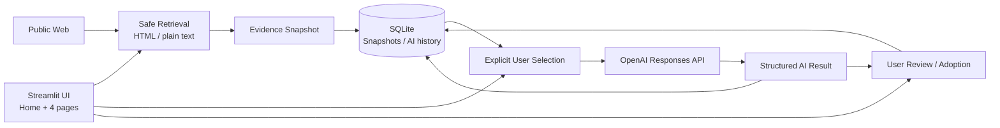

# CareerLens

## 企業研究を、もっと速く・深く。

公開情報とAIを活用し、<br>
企業理解から選考準備までを一つの流れで支援する、企業研究・選考準備支援ツールです。

CareerLensは、企業研究で集めた情報とその根拠を整理し、自分の就活軸・経験との接点を可視化するためのローカルファーストなAI支援アプリケーションです。

AIが企業やキャリアを「判定」するのではなく、情報整理と接点の発見を支援し、最終判断はユーザー自身が行う設計を重視しています。

> **Status:** v0.1 / Portfolio MVP / Local single-user application

## CareerLensの特徴

- 企業情報、参照元、取得時点の本文を分けて保存し、根拠へ戻れる
- AIに渡すEvidence Snapshotをユーザーが選び、根拠不足は「情報不足」として扱う
- AI提案は自動反映せず、内容と根拠を確認してフィールド単位で採用する
- 適合度を採点せず、企業情報 × 就活軸 × 経験の接点を選考準備材料として整理する

## Screenshots

### 1. Home

企業研究から選考準備までの4ステップを示します。



### 2. Company Research

企業情報・Source・Evidence Snapshotを一元管理する画面です。



### 3. Research Assistant

選択した根拠に基づくAI整理結果と出典を確認できます。



### 4. Selection Preparation

企業情報・就活軸・経験の接点を選考準備材料として整理します。



## 背景・課題

就職活動の企業研究では、次のような負担が生じます。

- 企業情報が公式サイト、採用サイト、IR資料、ニュース、個人メモに分散する
- 情報を集めても、自分の就活軸との接点を整理しにくい
- 面接準備のたびに、どの経験・エピソードを使うか見直す必要がある
- 生成AIの回答に情報源がなく、hallucinationや根拠のない補完を見分けにくい

CareerLensでは、企業研究を構造化し、Sourceと取得時点のEvidence Snapshotを保存します。選択した根拠だけをAIへ渡し、出力を確認してから採用できる流れにすることで、効率と検証可能性の両立を目指しました。

## 設計原則

| 原則 | v0.1での実装 |
|---|---|
| **Source-aware** | 企業情報、Source metadata、取得本文を分離し、元URLと取得履歴を保持 |
| **Evidence-backed** | 明示的に選択したSnapshot本文だけを企業事実の根拠としてAIへ送信 |
| **AI-assisted, not AI-decided** | AIは整理・接点候補を提示し、事実確認と最終判断はユーザーが実施 |
| **User-controlled** | AI提案は自動反映せず、フィールド単位の確認・採用操作を要求 |
| **Local-first** | 個人データと企業研究データをローカルSQLiteに保存 |

## Core Workflow



| Step | ページ | 主な役割 |
|---|---|---|
| 01 | My Profile | 志望職種、自由メモ、複数の就活軸、経験・エピソードを管理 |
| 02 | Company Research | 企業情報、Source、Web本文、Evidence Snapshotを企業単位で管理 |
| 03 | Research Assistant | 選択した取得本文を根拠に企業情報と不足情報を整理し、採用候補を提示 |
| 04 | Selection Preparation | 企業情報・就活軸・経験の接点を、面接や追加調査のための材料として整理 |

## 主な機能

### My Profile

- 志望職種と自由メモの保存
- 複数の就活軸のCRUD・優先順変更
- 複数の経験・エピソードのCRUD・タグ管理

### Company Research

- 複数企業の登録・編集・削除
- 事業、強み、戦略、DX・AI、海外事業、職種、メモの構造化
- 企業ごとのSourceメタデータ管理
- 公開Webページの本文取得とSnapshot履歴

### Research Assistant

- Sourceメタデータと取得済み本文の明確な区別
- 使用するSnapshotの明示的な選択
- Evidence-backedな構造化AI出力
- 根拠抜粋、情報不足、追加調査質問、制約の表示
- AI提案のフィールド単位での確認・編集・採用
- AI整理結果の履歴保存

### Selection Preparation

- 対象企業、就活軸、経験をユーザーが選択
- 企業 × 就活軸、企業 × 経験の接点整理
- 面接で深掘りする観点、準備したい質問、追加調査項目の提示
- 生成時の企業情報・就活軸・経験をSnapshotとしてAI結果に保存
- 結果を「最終回答」ではなく「選考準備材料」として表示

## AIがすること・しないこと

| AIがすること | AIがしないこと |
|---|---|
| 選択された情報の構造化 | URL先を読んだと偽ること |
| 根拠のある企業情報の整理 | 根拠にない企業事実の補完 |
| 情報不足と追加調査点の提示 | 企業との適合度の採点 |
| 就活軸・経験との接点候補の提示 | 使用する経験や就職先の決定 |
| 選考準備材料の提示 | 完成した志望動機・面接回答の断定 |

## Provenance

UI上のラベルで、入力・取得・生成・採用済み情報を区別します。

| 主な表示 | 意味 |
|---|---|
| `USER-ENTERED` / `USER-APPROVED` | ユーザー入力、または明示的に採用された現在のCompany Research情報 |
| `SOURCE METADATA` | タイトル、URL、種別、公開日、メモ。本文確認済みとはみなさない |
| `RETRIEVED EVIDENCE` | 指定URLから取得日時とともに保存したSource Text Snapshot |
| `AI-GENERATED` / `EVIDENCE-BACKED` | AIによる整理・提案、および使用Snapshotと根拠抜粋を持つ結果 |

`EVIDENCE-BACKED`は正しさや最新性の保証ではありません。詳細なデータフローと検証境界は[Architecture](docs/architecture.md)を参照してください。

## 技術アーキテクチャ



StreamlitをUI層とし、SQLite、Web取得、AI処理を通常のPython関数で分離しています。詳細は[Architecture](docs/architecture.md)を参照してください。

## Technology Stack

| 分類 | 技術 | 用途 |
|---|---|---|
| Application | Python | アプリケーションロジック（v0.1確認環境: 3.14.3、構文要件: 3.10+） |
| UI | Streamlit | 4ページ構成のローカルWeb UI |
| Database | SQLite | 個人データ、企業研究、Snapshot、AI結果の永続化 |
| AI | OpenAI Python SDK / Responses API | 構造化された研究支援・接点整理 |
| Retrieval | HTTPX / Beautiful Soup | 公開HTML・plain textの安全な取得と抽出 |
| Testing | pytest / unittest / Streamlit AppTest | DB、AI検証、取得、UI回帰テスト |
| Version Control | Git / GitHub | 小さなMilestone単位の開発履歴 |

## Project Structure

```text
careerlens/
├── app.py                          # Home / Streamlit entry point
├── pages/
│   ├── 1_my_profile.py            # プロフィール・就活軸・経験
│   ├── 2_company_research.py      # 企業・Source・本文取得
│   ├── 3_research_assistant.py    # Evidence-backed企業研究
│   └── 4_selection_preparation.py # 企業 × 就活軸 × 経験
├── careerlens/
│   ├── database.py                # SQLite schema and CRUD functions
│   ├── source_retrieval.py        # Web取得・抽出・安全性検証
│   ├── ai_service.py              # AI入力・呼び出し・出力検証
│   ├── prompts.py                 # Truthfulness rules and JSON schemas
│   └── ui.py                      # 共通UI tokens and navigation
├── data/
│   └── .gitkeep                   # DB本体はGit管理外
├── tests/                         # DB / AI / Retrieval / UI tests
├── docs/
│   ├── product-requirements.md
│   ├── architecture.md
│   ├── portfolio-presentation.md
│   └── v0.1-release-check.md
├── .env.example
└── requirements.txt
```

## Responsible AI / Anti-fabrication Design

- 企業研究AIには、現在のCompany Research情報とユーザーが選択したSnapshot本文だけを送信
- `source_id` / `snapshot_id`の所有関係と、根拠抜粋が保存本文に含まれることをアプリ側で検証
- JSON Schemaによる構造化出力に加え、根拠不足時の状態・文言を検証
- AI入力は1 Snapshotあたり20,000文字、合計60,000文字に制限し、入力時の省略状態を結果に記録
- AI結果は`ai_results`へ分離保存し、Company Researchへの反映には明示的な採用操作を要求

Web取得はHTML / plain textに限定し、2 MiBを超えるresponseは省略保存せず拒否します。HTTP/HTTPS以外、localhost、private/reserved IPを拒否し、redirect先も再検証します。timeoutとredirect回数にも上限があります。

## ローカルでの実行

### 1. Repositoryを取得

```bash
git clone https://github.com/XN73923/careerlens.git
cd careerlens
```

### 2. Virtual environmentを作成

```bash
python -m venv .venv
source .venv/bin/activate
```

Windows PowerShellの場合：

```powershell
.venv\Scripts\Activate.ps1
```

### 3. Dependenciesをインストール

```bash
python -m pip install -r requirements.txt
```

### 4. AI機能を利用する場合のみ環境変数を設定

```bash
cp .env.example .env
```

`.env`の`OPENAI_API_KEY`を自分のキーに置き換えてください。`OPENAI_MODEL`は任意で変更できます。APIキーがなくても、プロフィール・企業・Source・取得本文の管理機能は利用できます。

### 5. 起動

```bash
streamlit run app.py
```

初回起動時に`data/careerlens.db`が自動作成されます。このDBと`.env`はGit管理対象外です。

## Test

DB/UIテストは一時SQLite DBを使用し、取得・AI通信はHTTPX MockTransportとfake OpenAI clientで検証します。テストは`data/careerlens.db`、実ネットワーク、実APIを変更しません。

```bash
python -m pytest -q
python -m compileall -q app.py careerlens pages tests
python -m pip check
git diff --check
```

最新の確認結果は[v0.1 Release Check](docs/v0.1-release-check.md)に記録しています。

## Development Process

最初にProduct Requirementsとデータモデルを定義し、外部APIに依存しない機能から小さなMilestone単位で実装しました。

```text
Requirements
  → App shell / SQLite
  → My Profile / Job Axes / Experiences
  → Company Research / Sources
  → AI Research Assistant
  → Webpage Retrieval / Evidence Snapshot
  → Evidence-backed AI / Controlled Adoption
  → Selection Preparation
  → Final UI / Navigation Polish
```

各Milestoneで、スコープ制限、回帰テスト、手動確認を行ってからGit履歴に残しています。設計判断とデモの説明例は[Portfolio Presentation](docs/portfolio-presentation.md)にまとめています。

## 現在の制約

- ローカル・シングルユーザー向けで、認証やクラウド同期はない
- OpenAIを利用する機能にはAPI keyと利用可能なcreditが必要
- 本文取得は静的なHTMLとplain textが対象で、JavaScriptレンダリングには非対応
- PDF本文取得、Latest News検索、ニュース自動監視は未実装
- Snapshotは取得時点のSource Textであり、正確性・最新性を保証しない
- Company Comparison、適合スコア、自動推薦は実装していない
- 完成したES・志望動機・面接回答を自動生成する製品ではない

## Future Work

- PDF / IR・統合報告書の安全な取得
- Latest News検索と、選択した記事のSource保存
- 企業比較ビュー
- レポート出力
- 必要性を検証した上での認証・デプロイ対応

## Documents

- [Product Requirements](docs/product-requirements.md)
- [Architecture](docs/architecture.md)
- [Portfolio Presentation](docs/portfolio-presentation.md)
- [v0.1 Release Check](docs/v0.1-release-check.md)

## License

[MIT License](LICENSE)
