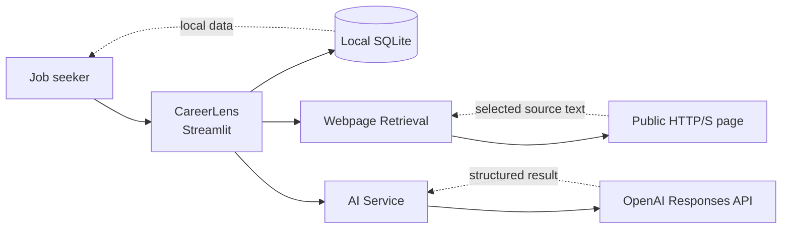
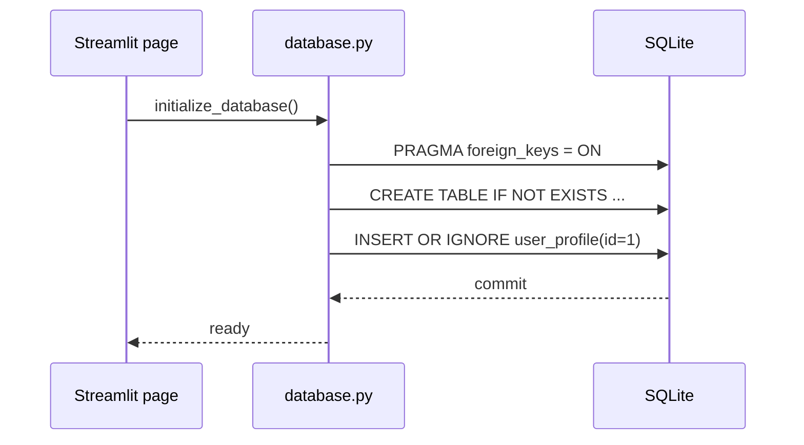
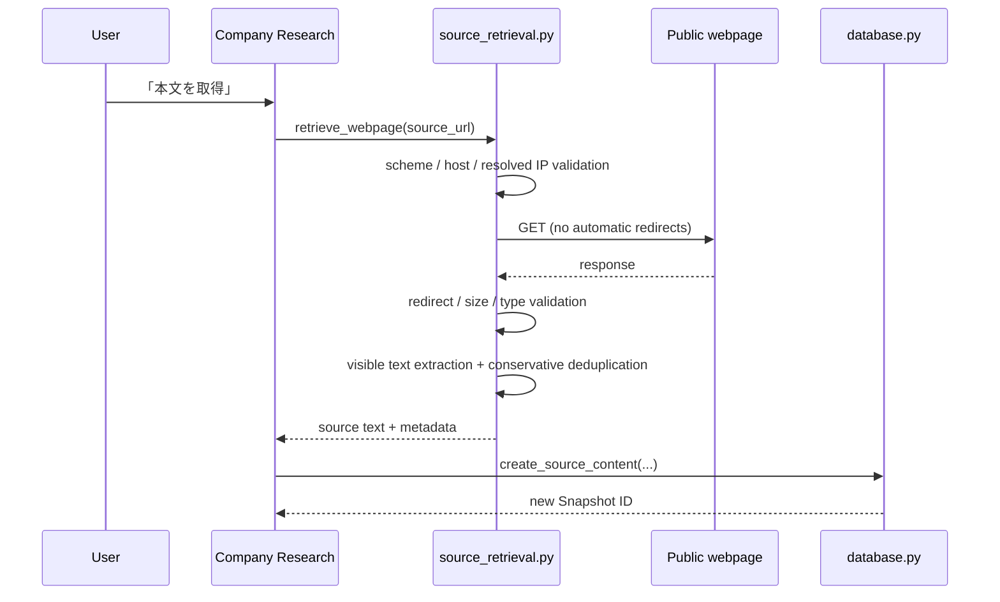
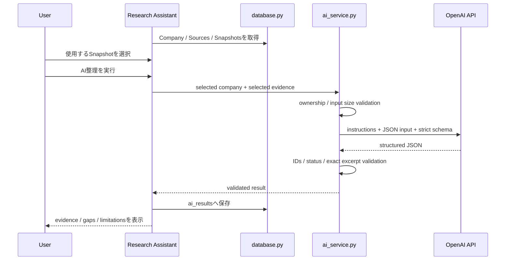
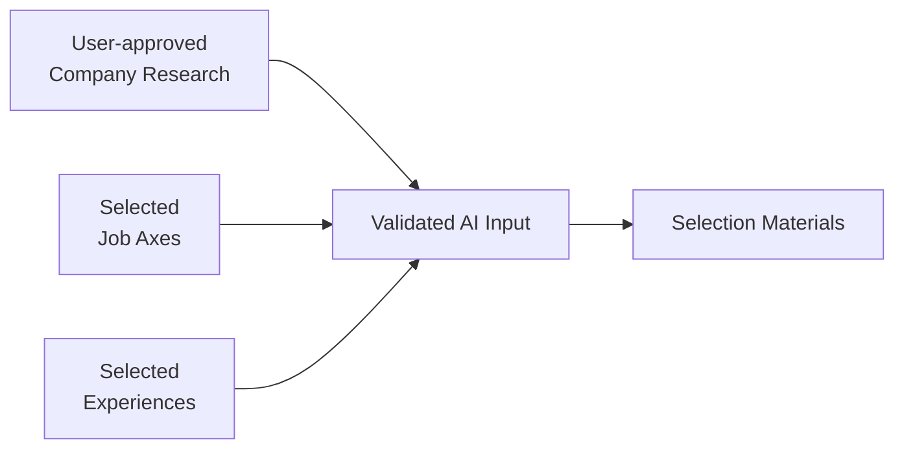
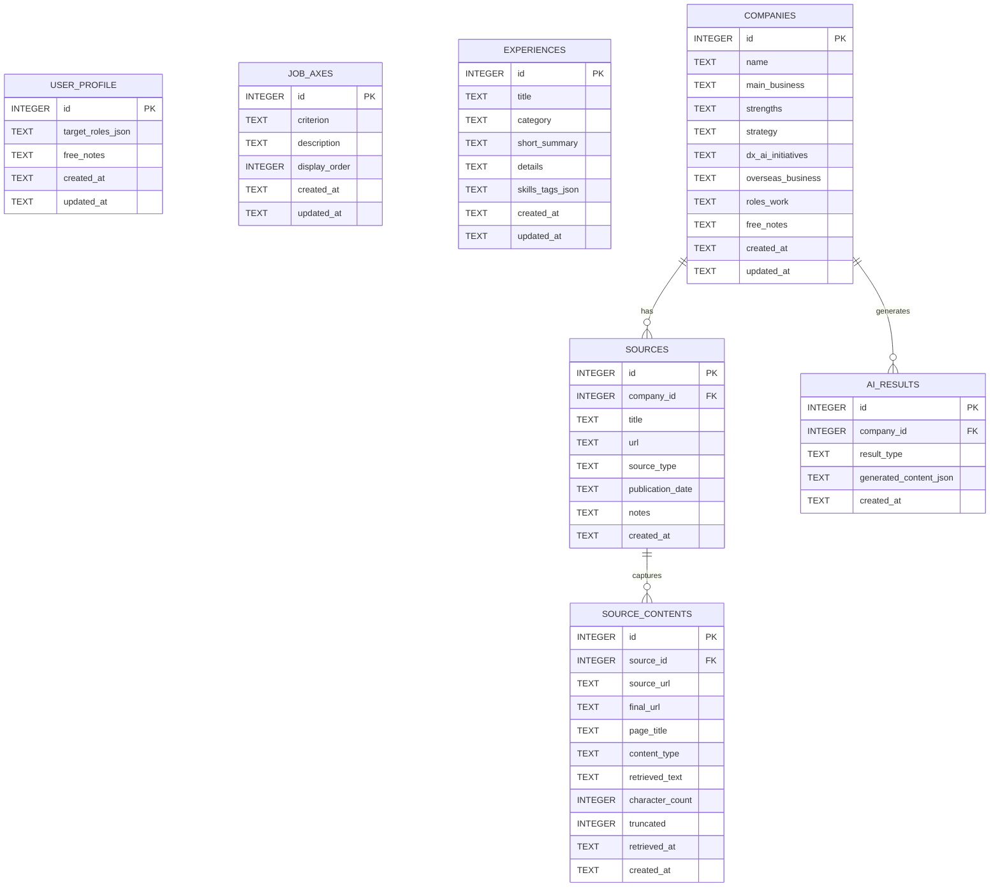
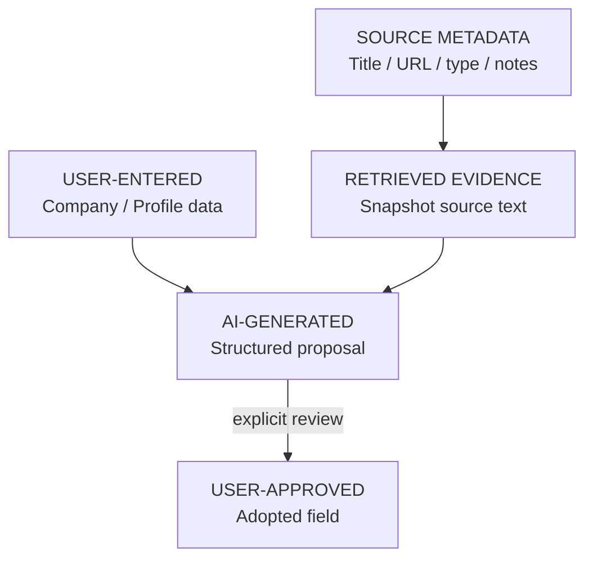

# CareerLens v0.1 Architecture

## 1. Overview

CareerLensは、Streamlit、通常のPython関数、SQLiteを中心に構成したローカル・シングルユーザー向けアプリケーションです。

v0.1では、次の責務だけを分離しています。

- UIとユーザー操作
- SQLiteへの永続化
- 公開Webページの安全な取得と本文抽出
- AI入力の構築、API呼び出し、構造化出力の検証
- Truthfulness rulesとJSON Schema

Repository、Dependency Injection、非同期worker、Vector Databaseなどは導入していません。小規模なMVPとして処理経路を追いやすくし、必要になるまで抽象化を増やさない判断です。

## 2. System Context

外部への通信が発生するのは、ユーザーが本文取得またはAI実行を明示的に操作した場合だけです。通常のページ表示、CRUD、履歴閲覧では外部通信を行いません。

## 3. Component Responsibilities

| Component | Responsibility |
|---|---|
| `app.py` | Home、製品メッセージ、起動時のDB初期化 |
| `pages/1_my_profile.py` | 基本プロフィール、就活軸、経験・エピソードのUI |
| `pages/2_company_research.py` | 企業・Source CRUD、本文取得、Snapshot表示 |
| `pages/3_research_assistant.py` | Evidence選択、企業研究AI、結果表示、Controlled Adoption |
| `pages/4_selection_preparation.py` | 企業・就活軸・経験の選択、接点整理、結果履歴 |
| `careerlens/database.py` | Schema、connection、validation、CRUD、transaction |
| `careerlens/source_retrieval.py` | URL検証、HTTP取得、本文抽出、保守的な重複除去 |
| `careerlens/ai_service.py` | API設定、入力制限、OpenAI呼び出し、結果検証 |
| `careerlens/prompts.py` | Anti-fabrication instructions、strict JSON Schema |
| `careerlens/ui.py` | 共通design tokens、sidebar navigation、provenance label |

UIページはworkflowの調整役です。永続化、取得、AI処理を各moduleへ渡し、複雑なdomain layerは設けていません。

## 4. Runtime Flow

### 4.1 Application Startup

初期化はidempotentです。DBは`data/careerlens.db`に作成され、Git管理対象外です。

### 4.2 Webpage Retrieval and Evidence Snapshot

再取得時は過去レコードを上書きせず、新しい`source_contents`レコードを作成します。UIは最新本文を表示し、過去分は取得履歴として折りたたみます。

### 4.3 Evidence-backed Research

Source metadataだけでは企業事実の根拠にしません。`supporting_excerpt`は、選択済みSnapshot本文に存在する400文字以内の完全一致文字列であることをアプリ側でも検証します。

### 4.4 Controlled Adoption

AI結果とCompany Researchは別データです。採用処理には以下の制約があります。

1. 保存済みEvidence-backed resultを対象にする
2. Source ID、Snapshot ID、取得日時、Source title、excerptを再検証する
3. 採用可能な企業フィールドだけを許可する
4. ユーザーが「採用」「編集して採用」「採用しない」を選択する
5. 既存値を置き換える場合は追加確認を行う

AI結果だけでCompany Researchが更新される処理はありません。

### 4.5 Selection Preparation

選択した就活軸と経験だけをAIへ送信します。結果に含まれるIDと入力Snapshotを検証し、`meaningful`、`weak`、`insufficient`をスコアではない状態として扱います。生成時の企業情報・就活軸・経験は`ai_results.generated_content`内に保存されます。

## 5. Data Model

承認時の6つのcore tableに、Web本文の取得履歴を保持する`source_contents`を追加した7-table構成です。

### Storage Decisions

- `user_profile.id = 1`をsingletonとして使用
- target rolesとskills/tagsはJSON textで保存
- AI出力と生成時入力SnapshotはJSON textで保存
- Source本文はSource metadataから分離
- 企業削除時はSource、Source Content、AI Resultをforeign-key cascadeで削除
- すべてのconnectionでSQLite foreign keysを有効化

## 6. Provenance Boundaries

これらはUI上のlabelだけでなく、保存先と処理経路でも区別しています。ただし、`EVIDENCE-BACKED`は内容の正確性や最新性を保証するlabelではありません。どのSnapshotに基づいたかを追跡できることを意味します。

## 7. Retrieval Safety

`source_retrieval.py`は、一般的なcrawlerではなく、ユーザーが指定した1 URLを明示的に取得する小さなretrieval layerです。

- HTTP / HTTPS以外を拒否
- credential付きURLを拒否
- localhost、`.local`、`.internal`を拒否
- DNS解決したすべてのIPがpublicであることを確認
- redirect先を毎回再検証
- automatic redirectを無効化し、最大3回まで手動追跡
- proxy環境変数を使用しない（`trust_env=False`）
- 10秒timeout、2 MiB response limit
- `text/html`と`text/plain`だけを許可
- script、style、noscript、template、SVGを本文から除外
- 完全一致または空白正規化後に一致するblockだけを保守的に重複除去

PDF、JavaScript rendering、linked-page crawlingには対応していません。

## 8. AI Safety and Validation

- OpenAI Responses APIへ`store=False`で送信
- 入力はユーザーが明示的に選択したデータだけで構築
- 1 Snapshotあたり20,000文字、合計60,000文字を上限に調整
- strict JSON Schemaでresponse shapeを指定
- 必須key、type、ID、重複、selected inputとの一致を再検証
- Evidence不足時のstatusと定型文を検証
- excerptが選択済み本文に存在することを検証
- truncationがある場合、結果のlimitationsに記載されていることを検証
- API key、raw exception、不要なAPI詳細をUIに表示しない
- insufficient creditは安全な専用メッセージへ変換

これらはhallucinationを完全になくす保証ではありません。出力範囲を狭め、根拠と不確実性を確認しやすくする防御です。

## 9. State and Error Handling

- 永続データはSQLiteへ保存
- create/edit/delete/confirmationなど一時的なUI状態は`st.session_state`で管理
- 保存、削除、取得、AI実行は明示的なbutton actionのみ
- database、retrieval、API errorは日本語の安全なmessageへ変換
- AI結果のDB保存に失敗した場合は、session-only resultとして表示
- TimestampはDBではUTC互換の値を維持し、UIではJST表示

## 10. Test Strategy

| Layer | Main coverage |
|---|---|
| Database | 初期化、CRUD、ordering、cascade、JSON、timestamps、ownership |
| Retrieval | URL safety、redirect、size/type limit、抽出、deduplication、errors |
| AI Service | input scope、structured validation、evidence excerpts、quota mapping |
| Streamlit UI | company isolation、retrieval persistence、AI execution/adoption、selection flow |
| Navigation | labels、destinations、technical filename非表示 |

Database testはtemporary directory、HTTP testは`httpx.MockTransport`、AI testはfake client、UI testはStreamlit `AppTest`を使用します。実API、実Web、`data/careerlens.db`には依存しません。

## 11. Trade-offs and Boundaries

- SQLiteはlocal-firstには十分だが、multi-user concurrencyには向かない
- Streamlitは短期間でworkflowを検証しやすい一方、複雑なfrontend stateには制約がある
- JSON保存はAI result versionごとのSnapshotに適する一方、横断queryには不向き
- 静的HTML取得は安全性と実装量を抑えられる一方、JavaScript-heavy siteを扱えない
- provider-specific codeは`ai_service.py`に閉じているが、v0.1ではOpenAI providerを使用する

この境界は、v0.1で必要な「企業研究の根拠を残し、ユーザー主導でAIを使う」体験を優先した結果です。
